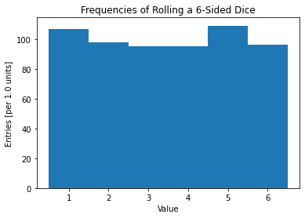

# Questions for Discussion

## 2.1

> Is this what you were expecting?

Yes, based on the code, this was what I was expecting.

## 2.2

> Can you think of a better way to represent the results?

I think it'd be better to have the x-axis be the value and the y-axis be the frequency.

## 3.1

> What do you think about how the data are presented in the previous two plots?

The plots are much better than the initial plot. At the very least, they're intelligible. However, they're still not perfect. For instance, the line plot implies continuous x-values when—in reality—the x-values are discrete.

## 3.2

> How might they be presented more clearly?

We could use vertical bars instead of using points or line segments (i.e., using a bar graph). Additionally, we could remove the 0 value (which is an artifact of zero-indexing in Python).

## 4.1

> There are 6 items in the first array, but 7 items in the second. Why?

Because, generally, if we want to have $n$ bins we need to have $n+1$ bin edges.

## 5.1

> What are wrong with the next two histograms?

A problem unique to the first histogram is that the 6 values are totally neglected, and a problem unique to the second histogram is that there are only 5 bins when there should be 6 (to count the output frequencies of rolling a 6-sided dice). One problem with both histograms is that the y-axis label claims that the x-axis is being split up in units of 0.5 when, in reality, it's being split up in units of 1.

## E.1

> Make a better version of the plot, explain what you did, and include details in your report.

I made a few modifications. For starters, I fixed the y-axis label to claim that the x-axis is being split up in units of 1. I also used 7 bin edges in order to get 6 bins. Finally, I added a title to describe the contents of the histogram.

```python
plt.xlabel("Value")
plt.ylabel("Entries [per 1.0 units]")
plt.title("Frequencies of Rolling a 6-Sided Dice")
plt.hist(dataSampleD6, bins=np.linspace(0.5, 6.5, 7))
plt.show()
```


