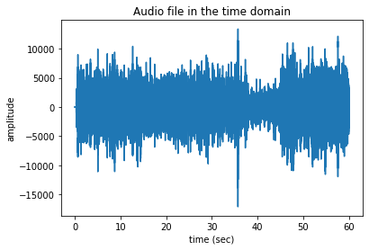

# Questions for Discussion

## 1.1

> What features of the music can be understood by the time domain plot? How well can these features be determined by just listening to the music?

The time domain plot can help us understand the "intensity" of the music at a particular point in time as measured by its volume at that time. For example, by looking at the time domain plot, I was able to pick out a period of decreased music intensity from around 37-45 seconds that corresponded to the quieter part of a drum solo in the music (i.e., `CantinaBand60.wav`). These features are easily accessible by just listening to the music.

## 1.2

> What features of the music can be understood by the frequency domain plot? How well can these features be determined by just listening to the music? For example, can you associate specific sounds or instruments in the music with peaks in the frequency space plot?

The frequency domain plot can help us understand the spectral composition of a piece of music. This is not easily determined by just listening to the music because the sound waves of different frequencies are superimposed on top of each other simultaneously in time. It's probably possible to pick out the presence of various sounds/instruments in the music by looking at the frequency domain plot (e.g., the alto saxophone has a normal frequency range of 138-830 Hz which is well-represented in the frequency domain plot).

## 1.3

> Now choose a different music sample and compare/contrast the frequency space representation of the music. Does this make sense with what you hear from both files?

This time, I chose `PinkPanther60.wav` instead of `CantinaBand60.wav`. The frequency space representation of these 2 pieces of music are definitely different, but it isn't immediately obvious to me the best way to describe their differences. One similarity is that roughly the same range of frequencies (i.e., from around 50-10000 Hz) was represented; this makes sense because this falls within a comfortable range of human hearing. One different is that `PinkPanther60.wav` features fewer high-frequency waveforms, which is immediately obvious when listening to the music.

## 2.1

> For each of the three signals above (not including the single sine wave): Was one representation of the data more informative than the other? Is there information that you can understand from one representation that you can't from the other?

Generally speaking, I found that the frequency domain representation was a more informative and simple representation of the data because the time domain representation includes a lot of redundant information for the periodically-repeating waveforms. Because it's possible to convert between the time- and frequency-domain representations, there isn't any information we can understand from one and not the other.

## 2.2

> For the square wave signal, how do you think the frequency component with the largest magnitude relates to the frequency of the square wave as a whole?

They're the same frequency (i.e., 25 Hz)!

## 2.3

> Given your answer to 2.2, how would you then interpret the higher frequency components with smaller amplitude and their contribution to the square wave shape?

The higher frequency components are harmonics/overtones of the fundamental frequency and they help to approximate the squareness of the square wave.

## 3.1

> How does the low-pass-filtered square wave differ from the unfiltered wave in the time domain and the frequency domain? If this changes your understanding of the frequency space form of the square wave, make sure to go back and re-answer questions 2.2/2.3. Hint: if this question isn't making sense, try switching the filter type in the cell above to a high-pass filter and see what remains of the square wave.

In the time domain, the wave became less square and more sinusoidal. In the frequency domain, the heights of all the peaks decreased but the heights of the peaks at higher frequencies decreased more dramatically.

## 4.1

> Is the effect of the filter more clear in the time domain or the frequency domain?

The effect of the filter is far more clear in the frequency domain.

## 4.2

> How did the sound of the music change after filtering? Does this change agree with your intuition? Try varying the cut-off frequency in the code above to see when this effect becomes more or less significant.

The filtered music didn't have any of the low drones present in the original music, which agrees with my intuitive understanding of what happened.
